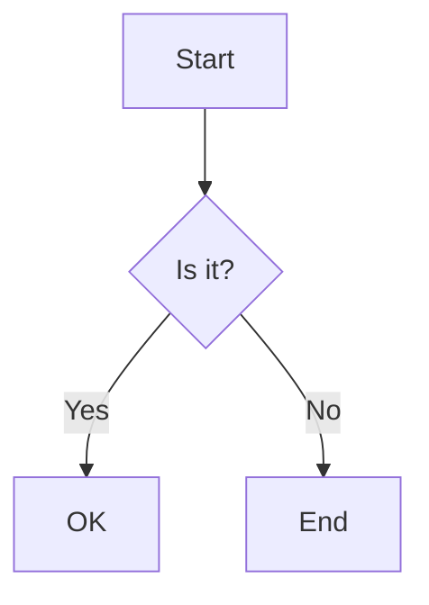

# Mermaid Diagrams in Wiki Documents

Date: 2026-06-18
Status: **Implemented on top of [PR #627](https://github.com/frappe/wiki/pull/627)** (by adamwu7), pending in-app verification. Rather than build from scratch, we adopted that PR's solid infrastructure and refactored the weak parts to this spec. See [Reconciliation](#reconciliation--what-changed-vs-the-plan) for deviations from the original plan below.

## Goal

Let authors create, edit, and embed [Mermaid](https://mermaid.js.org/) diagrams (flowcharts, sequence diagrams, ERDs, gantt charts, state machines, etc.) inside a wiki page. From the editor, the author inserts a **Mermaid block** (toolbar button or `/mermaid` slash command) and gets a split editing experience: a **code pane** for the Mermaid source with a **live-updating SVG preview** and inline syntax-error feedback. The same diagram renders as an SVG on the **public** (server-rendered) reader side.

This mirrors the existing custom-block authoring patterns in wiki — `callout-block.js` (a recognized fenced block with full markdown round-trip) and `pdf-block.js`/`pdf-viewer.js` (a client-side library hydrating a server-rendered placeholder across the editor **and** the non-Vue public reader). The PDF feature is the closest end-to-end precedent and most lessons below are inherited from it.

## Decisions

Settled during planning (via product Q&A):

- **Storage → a fenced ```` ```mermaid ```` code block.** This is the de-facto standard (GitHub, GitLab, Obsidian, Notion all render this fence), so content stays portable, valid markdown, and copy-pasteable. **No backend schema change** — the diagram source lives inline in the existing `Wiki Document.content` (markdown) field. The diagram source *is* the fence body; there is no separate asset, no upload.
- **Read mode → client-side, lazy render.** Load the Mermaid library (~480 KB) in the browser **only on pages that contain at least one diagram**, and render to SVG after load (lazily, as blocks scroll into view). This matches the existing PDF.js hydration pattern (`pdf-viewer.js`) and avoids any heavyweight server-side render dependency (mermaid-cli/puppeteer). Trade-off accepted: diagrams require JS and pop in slightly after first paint; a `<noscript>`/pre-render fallback shows the raw source. (Server-side pre-render to SVG was considered and rejected for v1 — it needs a headless-browser toolchain on the Frappe server, which is disproportionate for v1.)
- **Editor UX → code pane + live preview.** A textarea/code pane for the Mermaid source beside (or above) a live-updating SVG preview, with inline syntax-error feedback driven by `mermaid.parse`. Not a code-block-only experience (too weak) and not a visual/drag diagram builder (out of scope, much larger).
- **Security → `securityLevel: 'strict'`.** Mermaid diagram source is **user-authored content** and Mermaid supports interactive features (`click` directives, HTML labels, hyperlinks) that are an XSS / script-injection surface. We initialize Mermaid with `securityLevel: 'strict'` (HTML labels off, `click`/script directives disabled, output sanitized) on **both** the editor and public sides. This is the single most important security decision in the feature — see [Security](#security).

## Library choice

**[Mermaid](https://github.com/mermaid-js/mermaid) (mermaid-js), v11.x** (latest `11.15.0` at time of writing). It is the canonical diagram-as-text engine (~70k★, the format every other tool copies), free/OSS (MIT), and ships a modern ESM build (`mermaid.esm.min.mjs`) that works both through Vite (editor) and as a vanilla dynamic `import()` (public reader) — one engine, identical output on both sides, exactly like PDF.js backs both the Vue and vanilla PDF paths.

Three APIs we use (all client-side):

- `mermaid.initialize({ startOnLoad: false, securityLevel: 'strict', theme })` — configure once; **never** auto-scan the DOM (we render on demand).
- `mermaid.render(id, source)` → `{ svg, bindFunctions }` — render a source string to an SVG string on demand. Used for the editor live preview and for each public block. (`bindFunctions` is for interactive diagrams; with `securityLevel: 'strict'` we still call it but no script handlers are attached.)
- `mermaid.parse(source, { suppressErrors: true })` — validate syntax without rendering, to drive inline error feedback in the editor without throwing.

**Bundle size note (~480 KB min):** Mermaid is large. It must be **lazy-loaded via dynamic `import()`** on both sides so it never enters the main editor bundle or loads on diagram-free pages. See [§5 packaging](#5-public-asset-packaging-for-mermaid).

Sources: [Mermaid](https://github.com/mermaid-js/mermaid) · [Usage / API docs](https://mermaid.js.org/config/usage.html) · [Security / `securityLevel`](https://mermaid.js.org/config/schema-docs/config.html)

## Current Wiki State (what we build on)

- **Editor:** TipTap v3 (Vue 3, ProseMirror). Custom block nodes live in `frontend/src/components/tiptap-extensions/`: `callout-block.js` (+`CalloutBlockView.vue`), `pdf-block.js` (+`PdfBlockView.vue`), `video-block.js`, `image-extension.js`, `iframe-block.js`. They register in `frontend/src/components/WikiEditor.vue`'s extensions array. Fenced code blocks are handled by `WikiCodeBlock` (`code-block-extension.js`, extends `@tiptap/extension-code-block-lowlight`) with `CodeBlockView.vue`. The toolbar is `tiptap-extensions/WikiToolbar.vue`; slash commands are `tiptap-extensions/slash-commands.js`. Icons are `lucide-vue-next`.
- **Content is stored as Markdown.** The editor runs with `contentType: 'markdown'` (`@tiptap/markdown`); nodes round-trip via `markdownTokenizer` / `parseMarkdown` / `renderMarkdown`. **`callout-block.js` is the exact template here**: it defines a block-level `markdownTokenizer` that claims a recognized fence (`:::type ... :::`) *before* the default tokenizers, and `renderMarkdown` emits the fence back. We do the same for ```` ```mermaid ... ``` ````, which means our Mermaid tokenizer must **win over the default fenced-code-block tokenizer** for `lang === 'mermaid'` (mirroring how the video block wins over the plain image node — a precedence concern, see Design).
- **Public reader is server-rendered Jinja + markdown-it-py + Alpine.js — NOT Vue.** Route intercepted by `WikiDocumentRenderer` (`wiki/frappe_wiki/doctype/wiki_document/wiki_document.py`); content rendered by `wiki/wiki/markdown.py::render_markdown_with_toc()` into `wiki/templates/wiki/document.html` (`{{ rendered_content | safe }}`). Fenced code blocks are rendered by the **`fence` render rule** (`fence_rstrip` in `markdown.py::_build_markdown`, line ~406), which already extracts `lang` from `tok.info` and emits `<pre><code class="language-X">`. **This is our single interception point in read mode** — branch on `lang == "mermaid"` and emit a hydration container instead of `<pre>`. No placeholder pre-scan is needed (unlike callouts/videos/PDFs) because the fence rule already hands us the raw, un-parsed source. Public enhancement JS lives in `wiki/public/js/` (`pdf-viewer.js`, `image-viewer.js`, `code-blocks.js`) and is wired into `wiki/templates/wiki/layout.html`, cache-busted via the existing `get_asset_hash(path)` jinja helper (`wiki/utils.py`, registered in `wiki/hooks.py`).
- **Read-mode code highlighting** is client-side: `code-blocks.js` runs `hljs.highlightAll()`. Our mermaid container must **not** be a `<pre><code>`, so hljs leaves it alone.
- Content fields have `ignore_xss_filter: 1` and the markdown renderer allows raw HTML — so the container HTML we emit passes through. We emit only our own controlled markup; the diagram source goes into a **data attribute / `<template>` (HTML-escaped)**, never into executable position, and Mermaid renders it under `securityLevel: 'strict'`.

## Non-Goals (v1)

- **No server-side SVG pre-render.** Client-side only (per Decisions). No mermaid-cli, no puppeteer/headless-chrome on the Frappe server, no build-time render.
- **No visual / drag-and-drop diagram builder.** Source-text editing only.
- **No diagram interactivity** (`click` directives, callbacks, hyperlinks inside diagrams). Disabled by `securityLevel: 'strict'`. (Re-enabling a *safe* subset is a possible Phase 2.)
- **No custom Mermaid plugins / icon packs / external diagram integrations** (e.g. architecture-beta icon packs that fetch remote assets).
- **No PNG/SVG export button** from the public viewer in v1 (possible Phase 2).
- **No diagram versioning / diffing** beyond what the normal page-content history already gives (the source is plain markdown, so history "just works").
- No multi-diagram-per-block; one diagram per fence/node.

## Design

### Markdown representation

A standard fenced code block with info string `mermaid`:

````markdown

````

- The fence body is the verbatim Mermaid source.
- **Editor precedence:** the Mermaid block's `markdownTokenizer` must match the ```` ```mermaid ```` fence and return a `mermaidBlock` token *before* the default code-block tokenizer claims it as a `WikiCodeBlock` with `language: 'mermaid'`. Mirror how `callout-block.js`'s tokenizer claims `:::` fences and how the video tokenizer wins over the image node. A non-`mermaid` fence (```` ```js ````, etc.) is untouched and still renders as a normal code block.
- **Read-mode precedence:** in `markdown.py`'s `fence` rule, branch on `lang == "mermaid"` first; everything else falls through to the existing `_render_codeblock_html`.

### 1. Editor — new node `mermaid-block.js` (+ `MermaidBlockView.vue`)

New files in `frontend/src/components/tiptap-extensions/`, modeled on `callout-block.js` (fence round-trip) + `PdfBlockView.vue` (rich node view with async library + loading/error states).

`mermaid-block.js`:
- `Node.create({ name: 'mermaidBlock', group: 'block', atom: true, draggable: true })`.
- **Attributes:** `source` (default `''`, the Mermaid text). Transient editor-only display state kept out of serialized markdown (mirroring the image/pdf `rendered: false` pattern): none strictly required since render state lives in the Vue view's local refs, but an optional `caption` could be added (Phase 2).
- `parseHTML` / `renderHTML`: emit a `div[data-type="mermaid-block"]` wrapper carrying the source in a child `<template>` or `data-source` attr (parallels `pdf-block`'s `data-type`/`data-src`). `renderHTML` is what gets parsed back from saved HTML; the live editor view comes from the node view.
- `markdownTokenizer` (name `mermaidBlock`, block level): `start(src)` returns `src.indexOf('```mermaid')`; `tokenize` matches `` /^```[ \t]*mermaid[ \t]*\n([\s\S]*?)\n```[ \t]*(?:\n+|$)/ `` and returns `{ type: 'mermaidBlock', raw: match[0], source: match[1] }`. Consume trailing blank lines after the closing fence (same round-trip-stability reason documented in `callout-block.js`).
- `parseMarkdown(token)` → `{ type: 'mermaidBlock', attrs: { source: token.source } }`.
- `renderMarkdown(node)` → `` `\`\`\`mermaid\n${node.attrs.source.trim()}\n\`\`\`\n\n` ``.
- `addNodeView()` → `VueNodeViewRenderer(MermaidBlockView)`.
- `addCommands()`: `setMermaid(attrs)` inserts the node (default `source` = a small starter flowchart so a blank insert immediately renders something, like a placeholder template). `/mermaid` and the toolbar both call this.

`MermaidBlockView.vue` (the in-editor split editor), modeled on `PdfBlockView.vue` + `CalloutBlockView.vue`:
- `NodeViewWrapper`, `contenteditable=false`, selection ring when `selected`.
- **Layout:** a code pane (a `<textarea>` or lightweight CodeMirror — start with a styled `<textarea>` to avoid a new dep; CodeMirror is already a transitive dep via TipTap but a plain textarea is simpler and sufficient for v1) bound to `node.attrs.source`, and a **live preview** pane rendering the SVG. Toggle/stack layout responsive (side-by-side on wide, stacked on narrow).
- **Lazy library load:** `const mermaid = (await import('mermaid')).default` on first edit/preview, cached at module scope so a page with many diagrams imports once. `mermaid.initialize({ startOnLoad: false, securityLevel: 'strict', theme: <synced> })`.
- **Live render:** on `source` change (debounced ~300 ms), call `await mermaid.parse(source, { suppressErrors: true })`; if valid, `await mermaid.render(uniqueId, source)` and set the preview `innerHTML` to `svg`. If invalid, keep the **last good** SVG and show an inline error banner with the parser message (no flicker to blank, no broken preview) — mirrors PDF's error state.
- **Unique render IDs:** Mermaid requires a unique element id per `render()` call; generate a per-instance counter-based id (e.g. `mermaid-edit-${instanceSeq}-${renderSeq}`) — **do not** use `Math.random()`/`Date.now()` patterns that collide; a module-scoped incrementing counter is safest and SSR-irrelevant here.
- **Theme:** read the current wiki light/dark mode and pass Mermaid `theme: 'default' | 'dark'`; re-render on theme change (watch the same signal the rest of the editor uses).
- Editing the code pane updates `node.attrs.source` via `updateAttributes({ source })` so it serializes on save. A delete (trash) control mirrors the other blocks.

### 2. Editor — registration (`WikiEditor.vue`)

- Import and register `MermaidBlock` in the `extensions` array. **Order matters**: register it so its `markdownTokenizer` is consulted before the code-block tokenizer for the mermaid fence (verify against how callout/video win; adjust array position or tokenizer `start`/`level` as needed).
- No upload wiring (unlike PDF) — the node is self-contained text. This makes Mermaid strictly simpler than the PDF feature on the editor side.
- Confirm `mermaid` is in `optimizeDeps`/dynamic-import-friendly config so Vite code-splits it into its own chunk (it should by default for `import()`).

### 3. Editor — toolbar + slash command

- **Toolbar** (`WikiToolbar.vue`): add a Mermaid/diagram button (lucide `Workflow` or `GitBranch` / `Network`) near the code-block button; on click → `editor.chain().focus().setMermaid().run()`.
- **Slash command** (`slash-commands.js`): add `{ title: 'Mermaid Diagram', description: 'Insert a diagram (flowchart, sequence, …)', icon: …, command: ({ editor, range }) => editor.chain().focus().deleteRange(range).setMermaid().run() }`.

### 4. Public reader — `markdown.py` + `mermaid-render.js` + template + CSS

**Python (`wiki/wiki/markdown.py`)** — branch the existing `fence` rule; **no placeholder pre-scan required**:
- In `_build_markdown`, modify `fence_rstrip` (line ~406): after extracting `lang`, if `lang == "mermaid"`, return a hydration container instead of `_render_codeblock_html(...)`:
  ```html
  <div class="wiki-mermaid" data-type="mermaid-block">
    <template class="wiki-mermaid-source">flowchart TD&#10;  A --&gt; B</template>
    <div class="wiki-mermaid-render"></div>
    <noscript><pre><code class="language-mermaid">flowchart TD
    A --&gt; B</code></pre></noscript>
  </div>
  ```
  - The source goes inside a `<template>` (inert, not rendered/executed by the browser) **HTML-escaped** via `escapeHtml` (already imported in `markdown.py`). `mermaid-render.js` reads `template.content.textContent` to recover the exact source. Using a `<template>` (vs a `data-` attr) avoids attribute-length/encoding pitfalls with multi-line source and keeps newlines intact.
  - `<noscript>` fallback shows the raw source as a code block so no-JS readers still see *something*.
- This is a ~10-line change to one function; the bulk of read-mode work is the JS + CSS.

**Public JS (`wiki/public/js/mermaid-render.js`)** — new file modeled on `pdf-viewer.js`:
- On load (and via `MutationObserver` on `#wiki-content` for SPA navigation, same as `pdf-viewer.js`/`image-viewer.js`), find every `.wiki-mermaid:not(.is-ready)`.
- **Bail fast on diagram-free pages:** if there are none, do nothing — Mermaid is never imported. Only when at least one exists do we lazily `import()` the vendored Mermaid and `initialize({ startOnLoad: false, securityLevel: 'strict', theme })`.
- Use an `IntersectionObserver` so each block renders when it scrolls into view (the ~480 KB lib still loads once on first visible diagram). For each block: read source from the `<template>`, `mermaid.render(uniqueId, source)`, inject `svg` into `.wiki-mermaid-render`, mark `.is-ready`. On parse error, show an inline error box with the message + keep the `<noscript>` source visible (don't leave a blank).
- **Theme:** read the page light/dark mode (same mechanism `code-blocks.js`/the layout uses) → Mermaid `theme`. Re-render on theme toggle if the public reader supports live theme switching.
- Loads the vendored Mermaid as an ES module; the file is included `type="module"`.

**Template (`wiki/templates/wiki/layout.html`)** — include `mermaid-render.js?v=<get_asset_hash>` (cache-busted, mirroring how `pdf-viewer.js`/`image-viewer.js`/`code-blocks.js` are wired). No static modal markup needed (everything renders inline).

**CSS (`wiki/public/css/main.css`)** — `.wiki-mermaid` container, centered SVG, max-width/overflow handling for wide diagrams (horizontal scroll on overflow), light/dark-aware background, and the inline error-box style. Consistent with existing block styling and prose tokens.

### 5. Public asset packaging for `mermaid`

Same risk and resolution as PDF.js (`pdfjs-dist`). The public reader is **not** built by the frontend Vite pipeline, so `mermaid` isn't automatically available there. Plan: **vendor** the prebuilt Mermaid ESM bundle into `wiki/public/js/vendor/mermaid/` and dynamic-`import()` it from `mermaid-render.js`.

- **Vendor as `.js`, NOT `.mjs`** — inherited hard-won lesson from the PDF spec: production nginx serves `.mjs` as `application/octet-stream`, and browsers refuse to execute module scripts with the wrong MIME type, breaking `import()`. `.js` is reliably served as `text/javascript`, and `import()` keys off MIME, not extension. So copy `mermaid.esm.min.mjs` → `wiki/public/js/vendor/mermaid/mermaid.min.js` (and any chunked sibling files Mermaid's ESM build emits — Mermaid lazy-loads diagram-type sub-bundles at runtime; **all** sibling chunks must be vendored and same-relative-path, or rename + verify the import map resolves; confirm during implementation whether the single-file `mermaid.esm.min.mjs` is fully self-contained or pulls sibling chunks).
  - **Open risk to verify early:** Mermaid v11's ESM build code-splits diagram types into separate chunks fetched on demand. If so, vendoring a single file is insufficient and we must vendor the whole `dist/` (renamed `.js`) preserving relative paths, or build a self-contained bundle. **Verify this in Phase 1 before committing to the vendoring layout** — it is the main implementation risk, exactly like pdfjs's worker file.
- Self-contained (works offline/air-gapped), version pinned in-repo, no external CDN runtime dependency (rejected default, same as PDF).
- The **editor** side imports `mermaid` from `node_modules` (added to `frontend/package.json`); Vite code-splits it. The two copies are independent (editor bundle vs vendored public file) — same arrangement as `pdfjs-dist`.

## Security

Diagram source is untrusted user input rendered as SVG in other readers' browsers — a classic stored-XSS surface. Controls:

- **`securityLevel: 'strict'`** on both editor and public `initialize()`: disables HTML in labels, ignores `click`/`callback`/`href` directives, and sanitizes rendered output. This is non-negotiable for v1.
- Source is transported to the client **HTML-escaped inside an inert `<template>`** (read mode) / as a TipTap node attr (editor) — never interpolated into executable HTML/attributes.
- The container markup is **server-controlled**; only the escaped source is author-derived.
- Confirm Mermaid's own DOMPurify usage is active under `strict` (it is by default) and that we don't override `dompurifyConfig` to re-allow scripts.
- Add a regression test asserting a malicious diagram (`click A "javascript:alert(1)"`, or an HTML-label injection) renders **without** the script surviving into the DOM.

## Acceptance Criteria

- Toolbar Mermaid button and `/mermaid` slash command both insert a Mermaid block with a starter diagram that immediately renders a preview.
- Editing the code pane live-updates the SVG preview (debounced); invalid syntax shows an inline error and keeps the last good render (no blank/broken preview, no editor freeze).
- The block round-trips: saving persists a ```` ```mermaid ```` fence; reloading the editor restores the Mermaid block (never a base64 blob, never a plain code block, never doubled blank lines on repeated saves).
- A non-mermaid fence (```` ```js ````, etc.) still renders as a normal highlighted code block in both editor and reader (no regression).
- On the **public** page the same diagram renders as an inline SVG; it renders after SPA navigation; diagram-free pages **never** load the Mermaid library (verify via network panel — no `mermaid*.js` request).
- No-JS / failed-import degrades to the raw source in a `<pre>` (`<noscript>` fallback), never a blank box.
- Light/dark theme is reflected in the rendered diagram on both sides.
- A diagram with a `click`/`javascript:` directive does **not** execute script (security regression test passes).

## Open Questions

- **Mermaid ESM chunking / vendoring layout** (main risk) — is `mermaid.esm.min.mjs` self-contained, or does it fetch per-diagram-type sibling chunks at runtime? Determines whether we vendor one `.js` file or the whole renamed `dist/`. Verify in Phase 1. (Parallel to pdfjs's worker-file packaging.)
- **Editor code pane: plain `<textarea>` vs CodeMirror.** v1 plan is a styled textarea (no new dep, no Mermaid-grammar wiring). Is line-numbered/highlighted Mermaid source editing wanted enough to justify CodeMirror? (Phase 2 candidate.)
- **Live-preview cost with many diagrams.** Debounce + render-on-visible mitigate it; do we need a "render" button instead of live for very large diagrams? (Mermaid render is synchronous-ish and can be slow for big graphs.)
- **Theme-switch live re-render** on the public reader — does the public reader support runtime light/dark toggle, or only initial? Re-render only if it does.
- **Max source size / pathological diagrams** — cap source length and/or guard render time to avoid a huge diagram hanging the tab? (Mermaid has some internal limits; confirm.)
- **Caption support** on the Mermaid node (mirror image/PDF caption) — Phase 2.

## Reconciliation — what changed vs the plan

Implemented by building on PR #627 (cherry-picked adamwu7's 3 commits onto our branch, preserving authorship) and refactoring to this spec. Deviations from the original plan above:

- **Library loading — global UMD script, not a Vite `import('mermaid')`.** The PR loads the vendored Mermaid as a global `window.mermaid` script (injected on demand) in **both** the editor and the public reader, via a shared loader (`wiki/public/js/mermaid-loader.js`, bridged into the editor by `frontend/src/.../mermaid-loader.js`). This is **better than the planned node_modules import**: Mermaid (~3.3 MB UMD) never enters the Vite bundle (no `mermaid` npm dep added), there's a single vendored copy, and it **sidesteps the spec's #1 risk** — the ESM build's runtime chunk-splitting — by using the self-contained UMD build. Adopted as-is.
- **Read-mode markup — `<pre class="mermaid">`, not a `<template>` container.** The PR emits `<pre class="mermaid">{escaped source}</pre>` and hydrates it with `mermaid.run({ nodes })`. This is simpler than the planned `<template>`+`<noscript>` and degrades gracefully (no-JS shows the raw source in the `<pre>`). Source is HTML-escaped server-side; client renders under `securityLevel:'strict'`. Kept the PR's approach; added a server-side escaping regression test.
- **`markdown.py` interception ported to markdown-it.** The PR targeted the old Mistune `WikiRenderer.block_code`; develop migrated to **markdown-it-py** 66 commits later. Re-implemented the `lang == "mermaid"` branch in the markdown-it `fence` rule (`_render_codeblock_html`) — same `<pre class="mermaid">` output, so the PR's test still passes.
- **Editor UX rewritten to this spec** (the PR's was weak): debounced render (300 ms) instead of per-keystroke; `mermaid` validates via render-catch and we **keep the last good SVG** on error (no flicker to blank); compact inline error; **light/dark theme sync** via the SPA's `wiki-theme` ref; stable collision-free render ids (no `Date.now()`); frappe-ui-token styling.
- **Hardening the PR missed:** the new public JS is **cache-busted** via `get_asset_hash` in `layout.html` (the PDF feature's lesson — avoids 12 h stale-cache bugs on deploy); the vendored bundle is `.js` (not `.mjs`), avoiding the production nginx MIME trap. Added the XSS/escaping and non-mermaid-fence regression tests.
- **Per-diagram lazy render (IntersectionObserver) not adopted.** The PR gates the *library load* on a page actually containing `.mermaid` (so diagram-free pages never fetch Mermaid — the key win), then renders all diagrams via `mermaid.run`. Render-on-visible remains a possible optimization for very diagram-heavy pages (Phase 2).

## Phase 2 (future, not in this spec)

- Diagram caption support (mirror image/PDF caption).
- Export rendered diagram as SVG/PNG from the public viewer and/or editor.
- Safe subset of interactivity (tooltips, internal-anchor links) under a tightened allowlist instead of full `strict` lockout.
- CodeMirror-based source editor with Mermaid syntax highlighting + autocomplete.
- "Insert template" gallery in the editor (flowchart / sequence / ERD / gantt starters).
- Optional server-side SVG pre-render for no-JS/SEO/first-paint (the rejected v1 path), behind a build/runtime flag.

## Files to touch (summary)

| File | Change |
|---|---|
| `frontend/src/components/tiptap-extensions/mermaid-block.js` | **New** — `MermaidBlock` node: `source` attr, fenced-`mermaid` markdown round-trip (tokenizer wins over code block), `setMermaid` command, node view |
| `frontend/src/components/tiptap-extensions/MermaidBlockView.vue` | **New** — in-editor split view: code pane + live SVG preview, lazy `import('mermaid')`, `parse`-driven inline errors, theme sync, last-good-render fallback |
| `frontend/src/components/WikiEditor.vue` | Register `MermaidBlock` (ordered so its tokenizer wins for the mermaid fence); no upload wiring |
| `frontend/src/components/tiptap-extensions/WikiToolbar.vue` | Mermaid toolbar button → `setMermaid()` |
| `frontend/src/components/tiptap-extensions/slash-commands.js` | `/mermaid` slash command |
| `frontend/package.json` | Add `mermaid` (^11) |
| `wiki/wiki/markdown.py` | In `fence_rstrip`: branch `lang == "mermaid"` → emit `.wiki-mermaid` container with escaped source in `<template>` + `<noscript>` fallback |
| `wiki/public/js/mermaid-render.js` | **New** — vanilla, lazy `import()` of vendored Mermaid, `IntersectionObserver` render, `MutationObserver` for SPA nav, `securityLevel: 'strict'`, theme + error handling (mirror `pdf-viewer.js`) |
| `wiki/public/js/vendor/mermaid/*` | **New** — vendored Mermaid ESM build renamed `.js` (single file or whole `dist/` per the chunking finding) |
| `wiki/templates/wiki/layout.html` | Include cache-busted `mermaid-render.js?v=<get_asset_hash>` |
| `wiki/public/css/main.css` | `.wiki-mermaid` container + error-box styles (centered SVG, overflow scroll, light/dark) |
| `e2e/tests/mermaid.spec.ts` | **New** — Playwright: insert → live preview → save/reload round-trip → public render → diagram-free page loads no mermaid lib → security (no script execution) |
